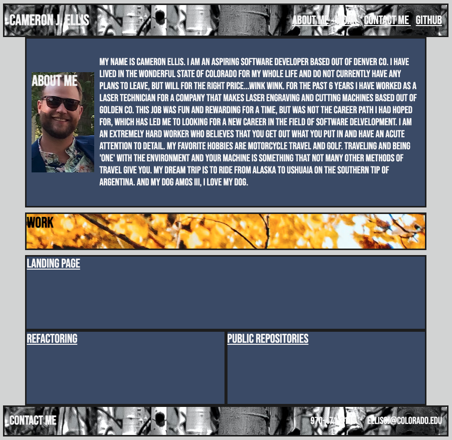

# HW2-Portfolio

The motivation for building this project is simple; the better portfolio you have the better chance you have at getting the job you want. The best way to show a potential employer that you are ready to code for them, is by showing them you can code. Having examples of different projects that display proficiency and or excellence at different skills/languages in a huge bonus in the job-search process.

Unfortunately, being so new to the game, I have little to show in terms of skills or excellence. I am committed to maintaining and updating this code with future projects and practice websites as I learn and grow my skills.

One thing I (and so many others) love about coding is the ability to make it your own and show your personality in your work. I am eager to learn and to watch my portfolio grow with me.

## Portfolio Screenshot

## Deployed Website Link:

https://elliscj.github.io/hw2-portfolio/

## License

MIT License

Copyright (c) [2021] [Cameron Ellis]

Permission is hereby granted, free of charge, to any person obtaining a copy
of this software and associated documentation files (the "Software"), to deal
in the Software without restriction, including without limitation the rights
to use, copy, modify, merge, publish, distribute, sublicense, and/or sell
copies of the Software, and to permit persons to whom the Software is
furnished to do so, subject to the following conditions:

The above copyright notice and this permission notice shall be included in all
copies or substantial portions of the Software.

THE SOFTWARE IS PROVIDED "AS IS", WITHOUT WARRANTY OF ANY KIND, EXPRESS OR
IMPLIED, INCLUDING BUT NOT LIMITED TO THE WARRANTIES OF MERCHANTABILITY,
FITNESS FOR A PARTICULAR PURPOSE AND NONINFRINGEMENT. IN NO EVENT SHALL THE
AUTHORS OR COPYRIGHT HOLDERS BE LIABLE FOR ANY CLAIM, DAMAGES OR OTHER
LIABILITY, WHETHER IN AN ACTION OF CONTRACT, TORT OR OTHERWISE, ARISING FROM,
OUT OF OR IN CONNECTION WITH THE SOFTWARE OR THE USE OR OTHER DEALINGS IN THE
SOFTWARE.
